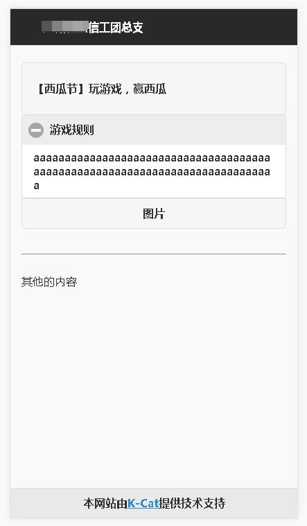

## 1.需求分析  

因为活动需求，我现在要做一个页面，目的是用在微信公众号上的。  
1. 使用的技术：jqueryMobile  
2. 风格设定：为了从简操作，总体页面打算模仿苹果的简化风格（大致使用黑白色），而布局上则参照相识的功能页面  
3. 布局设想：为了方便页面日后的重复使用，页面主要分为上下两块，上部分是活动的内容介绍，而下部分是活动的链接跳转  

---
## 2.jqueryMobile尝试  
### 1.代码解释  
1. ``
``：按钮组  
2. ``<a data-role="collapsible">``：下拉显示  
3. ``word-wrap: break-word`` ：自动换行样式  

之前的页面使用的是jquery mobile，但是做出来的效果不尽满意，所以打算改成bootstrap来做  
jqueryMobile开发的效果图：  
  
[源码](../SourceCode/xigua.html)

---

