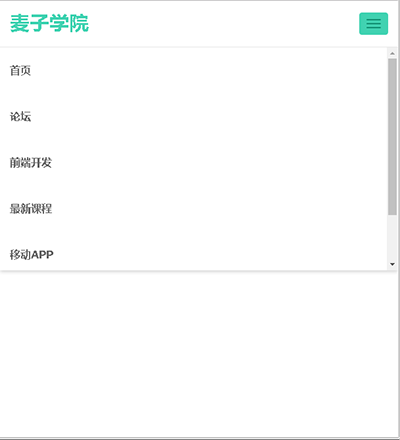
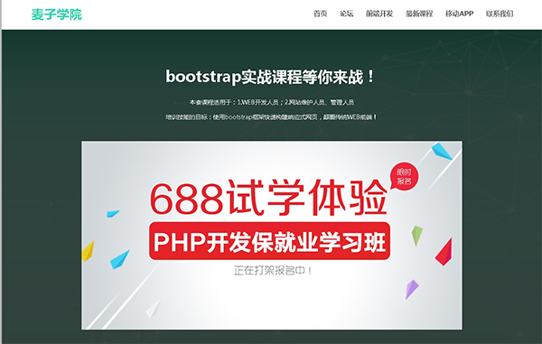
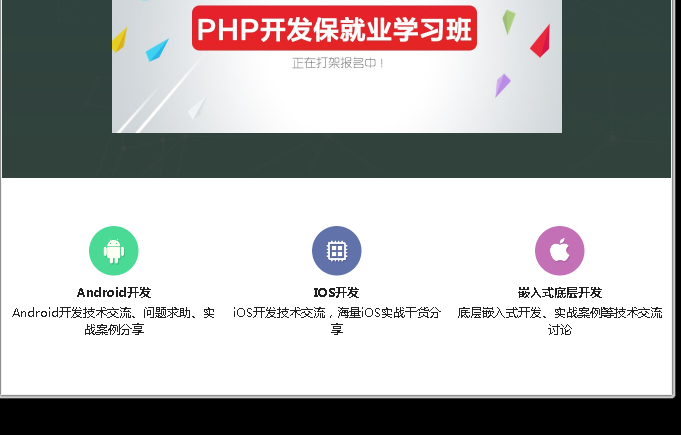
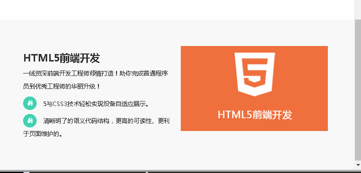
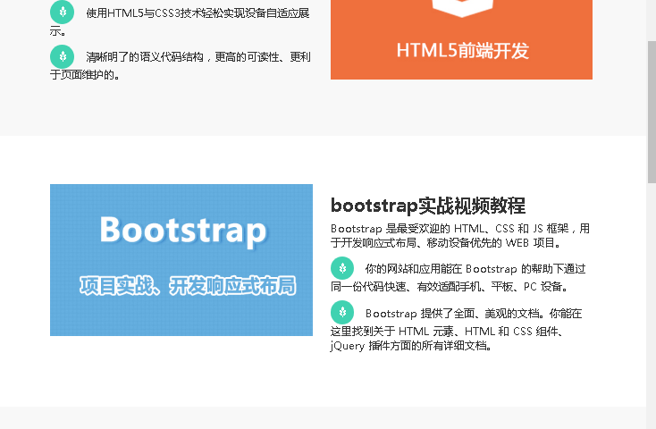

# K-Cat学院前台页面实战项目  

---

## 1.环境配置
1. 设置中文语言：``<html lang="zh-CN">``  
2. IE8开启渲染模式：``<meta http-equiv="x-ua-compatible" content="IE=Edge">``  
3. 视窗的配置：``<meta name="viewport" content="width=device-width, initial-scale=1, user-scalable=no">``  
initial-scale:初试的缩放比例，user-scalable=no:禁止用户缩放比例  
4. 引入jq文件，bootstrap css文件，js文件（使用加速器的方式引入）  
（百度静态网站加载库：http://cdn.code.baidu.com/）  

---

## 2.导航
### 1.结构
1. 固定上方：navbar-fixed-top  
2. 居右显示：ul中添加navbar-right

```html
<!--导航s-->
		<nav class="navbar navbar-default navbar-fixed-top">
		    <div class="container">
		    <div class="navbar-header">
	<!--小屏幕按钮-->
		        <button class="navbar-toggle" data-toggle="collapse"
		                data-target=".navbar-collapse">
		            <span class="sr-only">切换导航</span>
		            <span class="icon-bar"></span>
		            <span class="icon-bar"></span>
		            <span class="icon-bar"></span>
		        </button>
	<!--logo-->
		        <a class="navbar-brand" href="index.html">K-Cat学院</a>
		    </div>
		    
	<!-- 导航内容-->
		    <div class="collapse navbar-collapse">
		        <ul class="nav navbar-nav navbar-right">
		            <li><a href="index.html">首页</a></li>
		            <li><a href="#">论坛</a></li>
		            <li><a href="#">前端开发</a></li>
		            <li><a href="#">最新课程</a></li>
		            <li><a href="#">移动APP</a></li>
		            <li><a href="#">联系我们</a></li>
		        </ul>
		    </div>
		    </div>
		</nav>
<!--导航e-->
```
### 2.样式  
调整样式的方式：在google浏览器中f12寻找对应的选择器，然后在element.style中调试好之后再写到样式表中  
样式出不来一般是因为等级不够，所以要在看右边哪些被覆盖掉来判断等级  
1. 修改全局字体为微软雅黑  
2. 字体加粗：font-weight: bold;  
3. 设置行高：line-height: 35px;  

```css
.navbar-default .navbar-nav>li>a {
    font-size: 16px;
    font-weight: bold;
    color: #666;
    height: 70px;
    line-height: 35px;
}
.navbar-default .navbar-toggle:focus, .navbar-default .navbar-toggle:hover {
    background: #40d2b1;
    border-color: #40d2b1;
}
.navbar-default .navbar-toggle .icon-bar {
    background-color: #129073;
}
.navbar-toggle{
	margin-top: 18px;
}

```
效果图：  
  

---

## 3.第一屏  
### 1.结构
1. section代表的是章节，这里使用section来做模块  
2. 空的栅格化系统可以用来占位置  
3. img要自适应需要添加.img-responsive  

```html
<!--第一屏s-->
		<section id="home">
			<div class="lvjing">
				<div class="container">
					<div class="row"> <!-- 添加删格系统-->
						<div class="col-md-1"></div>   <!--用来占位置-->
						<div class="col-md-10">
							<h1>bootstrap实战课程等你来战！</h1>
							<p>
								本套课程适用于：1.WEB开发人员；2.网站维护人员、管理人员<br />
								培训技能的目标：使用bootstrap框架快速构建响应式网页，颠覆传统WEB前端！
							</p>
							 <!--img-responsive让图片自适应-->
						</div>
						<div class="col-md-1"></div>
					</div>
				</div>
			</div>
		</section>
<!--第一屏e-->
```  

### 2.样式  
1. 当我们排版文字的时候，常用的有``text-align：center``设置居中  
2. 做透明颜色，使用rgba``background:rgba(0,0,0,0.7); ``  
3. 为了让该元素不受上方元素影响，添加``display: inline-block;``  

```css
#home{
	margin-top: 70px;
	background: url(../images/home-bg.jpg);
	background-size: cover;
/*	height: 500px;*  高度不设，自己填充*/
	
	color: #FFFFFF;  /*文字颜色*/
	text-align: center;  /*文字居中*/
	width: 100%;   /*文字宽度100%*/

}
.lvjing{  /* 建一个滤镜*/
	width: 100%;
	height: 100%;
	background:rgba(0,0,0,0.7);  /*用rgba透明设置背景色*/
	padding: 90px;   /*为文字添加内边距*/
}
#home h1{
	font-weight: bold;
	margin-top: 0;  /*去掉上边距*/
	margin-bottom: 25px;   /*与下边内容拉开距离*/
}
#home p{
	font-weight: 400;
	line-height: 35px;
}
#home img{
	margin-top: 30px;
	display: inline-block;  /*加了之后,前面的内容对后面的排版不会产生影响*/
}
```

效果图：  
  

---

## 4.第二屏  
### 1.结构  
1. 添加img-responsive可能会导致图片错位，所以需要添加margin:0 auto;居中  
2. 排版一般用h3做标题，用p做内容，用br换行  
3. 嵌套关系：最外层是section--container--row--col

```html
<!--第二屏s-->
		<section id="bbs">
			<div class="container">
				<div class="row">
					<div class="col-md-4">
						<a href="http://www.kemao666.cn" target="_blank">
							
							<h3>Android开发</h3>
							<p>Android开发技术交流、问题求助、实战案例分享</p>
						</a>
					</div>
					<div class="col-md-4">
						<a href="http://www.kemao666.cn" target="_blank">
							
							<h3>IOS开发</h3>
							<p>iOS开发技术交流，海量iOS实战干货分享</p>
						</a>
					</div>
					<div class="col-md-4">
						<a href="http://www.kemao666.cn" target="_blank">
							
							<h3>嵌入式底层开发</h3>
							<p>底层嵌入式开发、实战案例等技术交流讨论</p>
						</a>
					</div>
				</div>
			</div>
		</section>
<!--第二屏e-->	
```

### 2.样式  
1. 让div中的所有文字居中：``text-align: center;``  
2. 添加边框阴影：``box-shadow: 1px 1px 4px #ccc;``  
3. 修改超链接的颜色和下划线：``text-decoration: none;``  

```css
#bbs{
	padding:80px 0;
	text-align: center;
}
#bbs .col-md-4{
    padding: 15px;
}
#bbs .col-md-4:hover{
    background: #f1f1f1;
    box-shadow: 1px 1px 4px #ccc;
}
#bbs a{
	color: #212121;
	text-decoration: none;
}

#bbs img{   /*处理用了img-responsive之后的错位*/
	margin:0 auto;
}
#bbs h3{
	font-weight: bold;
}  
```  

效果图：  
  

---

## 5.第三屏  
### 1.结构  
1. 不同类型的文字用不同个p来做  
2. 添加小图标，用span标签  
3. api网址：v3.bootcss.com  

```html
<!--第三屏s-->	
		<section id="html5">
			<div class="container">
				<div class="col-md-6">
					<h2>HTML5前端开发</h2>
					<p>一线资深前端开发工程师倾情打造！助你完成普通程序员到优秀工程师的华丽升级！</p>
					<p><span class="glyphicon glyphicon-fire mai-icon"></span>5与CSS3技术轻松实现设备自适应展示。</p>
					<p><span class="glyphicon glyphicon-fire mai-icon"></span>清晰明了的语义代码结构，更高的可读性、更利于页面维护的。</p>
				</div>
				<div class="col-md-6">
					
				</div>
			</div>
		</section>
<!--第三屏e-->	
	
```

### 2.样式  
1. 内容的对位使用padding内边距  
2. 图标变圆：``border-radius:50%``  

全局css:  
```css
.mai-icon{
    background: #40d2b1;
    color: #fff;
    border-radius: 50%;
    width: 40px;
    height: 40px;
    text-align: center;
    line-height: 40px;
    margin-right: 20px;
}
```  

```css
#html5{
	background: #f8f8f8;
	padding: 80px 0;
}
#html5 h2{
	font-weight: bold;
} 
#html5 p{
	line-height: 40px;
}
```

效果图：  
  

---  

## 6.第四屏  
### 1.结构  
因为跟前面相似，复制前面标签，对id和内容进行更换  

```html
<!--第四屏s-->
	<section id="bootstrap">
		<div class="container">
			<div class="col-md-6">
				
			</div>
			<div class="col-md-6">
				<h2>bootstrap实战视频教程</h2>
				<p>Bootstrap 是最受欢迎的 HTML、CSS 和 JS 框架，用于开发响应式布局、移动设备优先的 WEB 项目。</p>
				<p><span class="glyphicon glyphicon-fire mai-icon"></span>你的网站和应用能在 Bootstrap 的帮助下通过同一份代码快速、有效适配手机、平板、PC 设备。</p>
				<p><span class="glyphicon glyphicon-fire mai-icon"></span>Bootstrap 提供了全面、美观的文档。你能在这里找到关于 HTML 元素、HTML 和 CSS 组件、jQuery 插件方面的所有详细文档。</p>
			</div>
		</div>
	</section>
<!--第四屏e-->
```

### 2.样式  
样式的重复处理有点像代码编写，将相同的内容重复调用，不同的内容单独提取  

```css
/*第三屏+第四屏*/
#html5{
	background: #f8f8f8;
}
#html5,#bootstrap{
	padding: 80px 0;
}
#html5 h2,#bootstrap h2{
	font-weight: bold;
} 
#html5 p,#bootstrap p{
	line-height: 27px;
}
```

效果图：  
  

---  
