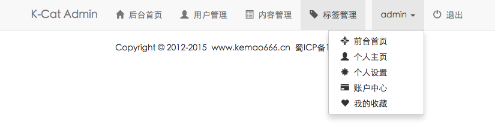
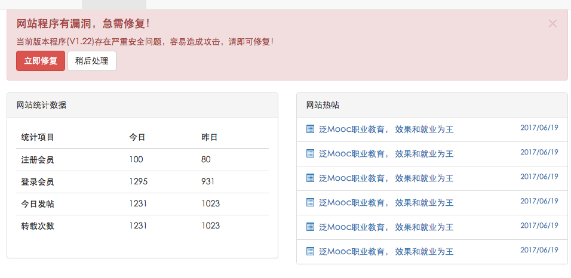
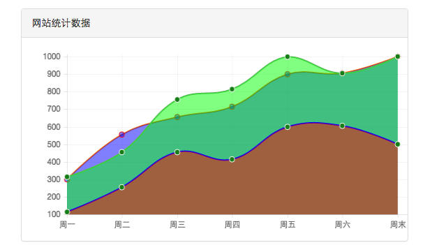
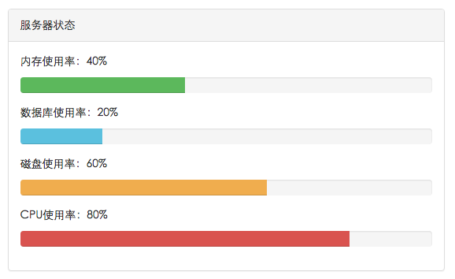
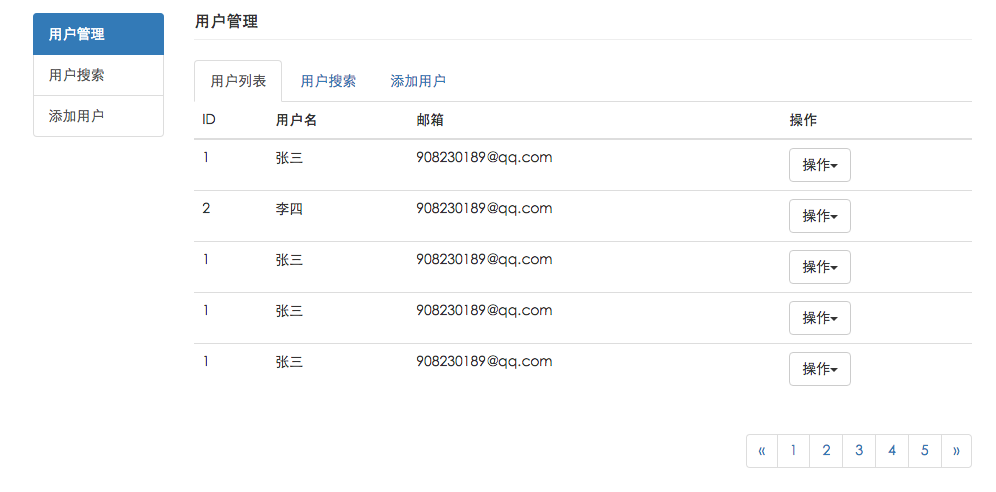
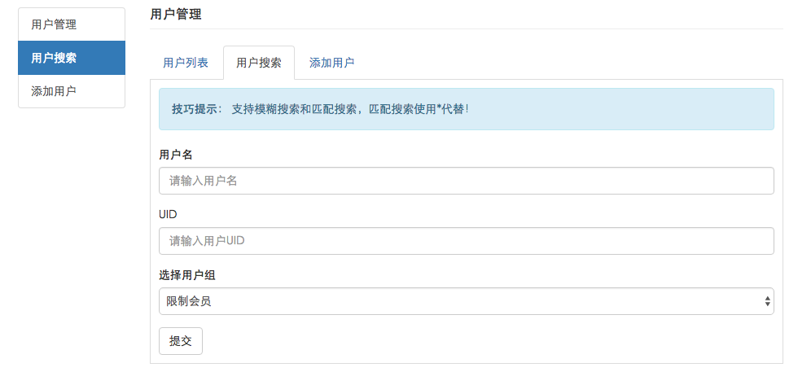
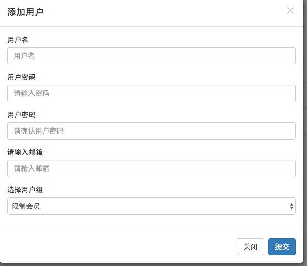

# K-Cat学院后台页面实战项目  

---

## 1.导航

### 1.导航内容

导航内容栏放左边，再做一个登录退出导航放右边。  

添加下拉框，顺便添加图标，因为下拉框本来是按钮，所以要修改为li变成导航的一部分，再修改为a去掉按钮样式  

```html
<ul class="nav navbar-nav navbar-right">

	<li class="dropdown">
		<!--修改div为li-->
		<a type="button" id="dropdownMenu1" data-toggle="dropdown" aria-haspopup="true" aria-expanded="false">
			admin
			<span class="caret"></span>
		</a>
		<!-- 修改button为a -->
		<ul class="dropdown-menu" aria-labelledby="dropdownMenu1">
			<li>
				<a href="index.html"><span class="glyphicon glyphicon-screenshot"></span>&nbsp;&nbsp;前台首页</a>
			</li>
			<li>
				<a href="#"><span class="glyphicon glyphicon-user"></span>&nbsp;&nbsp;个人主页</a>
			</li>
			<li>
				<a href="#"><span class="glyphicon glyphicon-asterisk"></span>&nbsp;&nbsp;个人设置</a>
			</li>
			<li>
				<a href="#"><span class="glyphicon glyphicon-credit-card"></span>&nbsp;&nbsp;账户中心</a>
			</li>
			<li>
				<a href="#"><span class="glyphicon glyphicon-heart"></span>&nbsp;&nbsp;我的收藏</a>
			</li>
		</ul>
	</li>

	<li>
		<a href="#bbs"><span class="glyphicon glyphicon-off"></span>&nbsp;&nbsp;退出</a>
	</li>
</ul>
```

### 2.导航页面    

1. 新建user_list.html,content.html,tag.html三个页面  
2. 修改导航链接，并且添加 ``class="active"``已选项  

效果图：  




---

## 2.网站统计和热帖

将所有的网页内容放在container里的row里面  

### 1.警告框  

警告框的button按钮添加``data-dismiss="alert"``可以把整个警告框关闭  

```html
<!--警告框s-->
<div class="col-md-12">
	<div class="alert alert-danger alert-dismissible fade in" role="alert"> <!--fade in消失动画效果-->
		<button type="button" class="close" data-dismiss="alert" aria-label="Close"><span aria-hidden="true">×</span></button>
		<h4>网站程序有漏洞，急需修复！</h4>
		<p>当前版本程序(V1.22)存在严重安全问题，容易造成攻击，请即可修复！</p>
		<p>
			<button type="button" class="btn btn-danger">立即修复</button>
			<button type="button" class="btn btn-default" data-dismiss="alert">稍后处理</button>   <!--data-dismiss="alert"点击后，框消失-->
		</p>
	</div>
</div>
<!--警告框e-->
```

### 2.网站统计  

网站统计数据也放在同一个row中

1. 新建一个面板  
2. 往面板的panel-body中添加表格  

```html
<!--网站统计数据e-->
	<div class="col-md-6">   <!--下一行包含在同一个row里面-->
		<div class="panel panel-default">   <!--添加一个面板-->
			<div class="panel-heading">网站统计数据</div>
			<div class="panel-body">
				<table class="table table-hover">   <!--添加表格-->
					<thead>    <!--表头-->
						<tr>
							<th>统计项目</th>
							<th>今日</th>
							<th>昨日</th>
						</tr>
					</thead>
					<tbody>   <!--表格主体-->
						<tr>
							<th scope="row">注册会员</th>
							<td>100</td>
							<td>80</td>
						</tr>
						<tr>
							<th scope="row">登录会员</th>
							<td>1295</td>
							<td>931</td>
						</tr>
						<tr>
							<th scope="row">今日发帖</th>
							<td>1231</td>
							<td>1023</td>
						</tr>
						<tr>
							<th scope="row">转载次数</th>
							<td>1231</td>
							<td>1023</td>
						</tr>
					</tbody>
					
				</table>
			</div>
		</div>
	</div>
<!--网站统计数据e-->
```

### 3.网站热帖  

1. 为了防止边框，去掉panel-body类标签  
2. 添加a链接，添加图标，用small标签添加时间  

```html
<!--网站热帖s-->
	<div class="col-md-6">
		<div class="panel panel-default">
			<div class="panel-heading">网站热帖</div>  <!--为了防止边框，去掉内容区标签-->
				<ul class="list-group">   <!--添加列表组-->
					<li class="list-group-item"><a href="#"><span class="glyphicon glyphicon-list-alt"></span>&nbsp;&nbsp;泛Mooc职业教育， 效果和就业为王<small class="pull-right">2017/06/19</small></a></li>
					<li class="list-group-item"><a href="#"><span class="glyphicon glyphicon-list-alt"></span>&nbsp;&nbsp;泛Mooc职业教育， 效果和就业为王<small class="pull-right">2017/06/19</small></a></li>
					<li class="list-group-item"><a href="#"><span class="glyphicon glyphicon-list-alt"></span>&nbsp;&nbsp;泛Mooc职业教育， 效果和就业为王<small class="pull-right">2017/06/19</small></a></li>
					<li class="list-group-item"><a href="#"><span class="glyphicon glyphicon-list-alt"></span>&nbsp;&nbsp;泛Mooc职业教育， 效果和就业为王<small class="pull-right">2017/06/19</small></a></li>
					<li class="list-group-item"><a href="#"><span class="glyphicon glyphicon-list-alt"></span>&nbsp;&nbsp;泛Mooc职业教育， 效果和就业为王<small class="pull-right">2017/06/19</small></a></li>
					<li class="list-group-item"><a href="#"><span class="glyphicon glyphicon-list-alt"></span>&nbsp;&nbsp;泛Mooc职业教育， 效果和就业为王<small class="pull-right">2017/06/19</small></a></li>
				</ul>
		</div>
	</div>
<!--网站热帖e-->
```

效果图：  



 ---

## 3.今日访问统计图

1. 下载引入chartjs.js文件:http://www.chartjs.org/  
2. 使用栅格化，里面放面板  
3. panel-body中添加画布，画布id设为canvas，并且占面板100%（12格）,引入曲线图插件（放在script.js里面）  

```html
<!--今日访问统计图s-->
	<div class="col-md-6">
		<div class="panel panel-default">
			<!--添加一个面板-->
			<div class="panel-heading">网站统计数据</div>
			<div class="panel-body">
				<canvas id="canvas" class="col-md-12"></canvas>
			</div>
		</div>	
	</div>
<!--今日访问统计图e-->
```

图标数据信息在script.js中修改，注释里面有写，数据的多少在data数组里面修改  

效果图：  



---

## 4.进度条

1. 做个栅格化，放个面板，里面复制一下进度条  
2. 添加文字标签，设置下边距调整总体表格大小  

```html
<!--状态进度条s-->
	<div class="col-md-6">
		<div class="panel panel-default">
			<!--添加一个面板-->
			<div class="panel-heading">服务器状态</div>
			<div class="panel-body">
				<p>内存使用率：40%</p>
				<div class="progress">
					<div class="progress-bar progress-bar-success" role="progressbar" aria-valuenow="40" aria-valuemin="0" aria-valuemax="100" style="width: 40%">
					</div>
				</div>
				<p>数据库使用率：20%</p>
				<div class="progress">
					<div class="progress-bar progress-bar-info" role="progressbar" aria-valuenow="20" aria-valuemin="0" aria-valuemax="100" style="width: 20%">
					</div>
				</div>
				<p>磁盘使用率：60%</p>
				<div class="progress">
					<div class="progress-bar progress-bar-warning" role="progressbar" aria-valuenow="60" aria-valuemin="0" aria-valuemax="100" style="width: 60%">
					</div>
				</div>
				<p>CPU使用率：80%</p>
				<div class="progress">
					<div class="progress-bar progress-bar-danger" role="progressbar" aria-valuenow="80" aria-valuemin="0" aria-valuemax="100" style="width: 80%">
					</div>
				</div>
			</div>
		</div>	
	</div>
<!--状态进度条e-->
```

效果图：  



---

## 5.留言板    

### 1.结构   

1. 留言板放在栅格化布局中，再添加一个面板，里面再嵌套一个栅格化布局  
2. 使用**媒体对象**做留言板：更改图片，修改标题，修改留言内容  
3. media中添加well可以添加边框，media-left可以控制图片左右  
4. 用form-group来做留言输入框，label为提示文字，textarea为输入框  
5. 用面板做联系人，里面放list-group  

```html
<!--留言板s-->
	<div class="col-md-12">
		<div class="panel panel-default">
			<!--添加一个面板-->
			<div class="panel-heading">团队留言板</div>
			<div class="panel-body">
				<div class="col-md-7">
					<div class="media well"> <!-- well为边框-->
						<div class="media-left">
							<a href="#">
								
							</a>
						</div>
						<div class="media-body">
							<h4 class="media-heading">卓大哥</h4>
							技术大哥，今晚请把网站程序升级一下哈，现在的系统有漏洞，安全起见！
						</div>
					</div>
				
					<div class="media well">  <!--well为边框-->
						<div class="media-body text-right">
							<h4 class="media-heading">技术王</h4>
							收到，今晚凌晨2点准时升级！	
						</div>
						<div class="media-right">
							<a href="#">
								
							</a>
						</div>
					</div>
				
					<div class="media well">
						<div class="media-body text-right">
							<h4 class="media-heading">技术王</h4>
							你先在站点发布一下通知哈！	
						</div>
						<div class="media-right">
							<a href="#">
								
							</a>
						</div>
					</div>
				
					<div class="media well">
						<div class="media-left">
							<a href="#">
								
							</a>
						</div>
						<div class="media-body">
							<h4 class="media-heading">卓大哥</h4>
							好嘞。
						</div>
					</div>
				</div>
				
				<div class="col-md-5">
					<form action="#">
						<div class="form-group">
							<label for="text1">输入留言内容</label>
							<textarea class="form-control" id="text1" rows="5" cols="10" placeholder="请输入留言内容"></textarea>
							<button type="submit" class="btn btn-default mar_t15">留言</button>
						</div>
					</form>
					<div class="panel panel-default">
						<!--添加一个面板-->
						<div class="panel-heading">团队联系手册</div>
						<div class="panel-body">
							<ul class="list-group">
								<li class="list-group-item">站长(李小龙)：<span class="glyphicon glyphicon-phone"></span>&nbsp;&nbsp;13134848615</li>
								<li class="list-group-item">技术(大牛哥)：<span class="glyphicon glyphicon-phone"></span>&nbsp;&nbsp;13456127694</li>
								<li class="list-group-item">推广(张二哥)：<span class="glyphicon glyphicon-phone"></span>&nbsp;&nbsp;13457815482</li>
								<li class="list-group-item">客服(王女士)：<span class="glyphicon glyphicon-phone"></span>&nbsp;&nbsp;13134567782&nbsp;&nbsp;<span class="glyphicon glyphicon-phone-alt"></span>&nbsp;&nbsp;028-888888</li>

							</ul>	
						</div>
					</div>
				</div>
			</div>	
		</div>		
	</div>
<!--留言板e-->
```

### 2.样式

1. 新增一个头像样式，设置宽高，圆形(以后可以多次使用)  
2. 新增上边距样式  

```css
.ph64{
	width: 64px;
	height:64px;
	border-radius:50% ;	
}
.mar_t15{
	margin-top: 15px;
}
```

效果图：  


---

## 6.用户管理  

### 1.结构  

1. 用list-group做竖直小导航  

```html
<!--用户列表小导航s-->
  <div class="col-md-2">
    <div class="list-group">
      <a href="user_list.html" class="list-group-item active">用户管理</a>
      <a href="user_list.html" class="list-group-item">用户搜索</a>
      <a href="user_list.html" class="list-group-item">添加用户</a>
    </div>
  </div>
<!--用户列表小导航e-->
```

2. 用项目卡+pageheader做用户列表  

```html
<!--用户列表内容s-->
    <div class="col-md-10">
      <div class="page-header">
        <h1>用户管理</h1>
      </div>
      <ul class="nav nav-tabs">
        <li class="active">
          <a href="#">用户列表</a>
        </li>
        <li>
          <a href="#">用户搜索</a>
        </li>
        <li>
          <a href="#">添加用户</a>
        </li>
      </ul>
      <table class="table">
        <thead>
          <tr>
            <th>ID</th>
            <th>用户名</th>
            <th>邮箱</th>
            <th>操作</th>
          </tr>
        </thead>
        <tbody>
          <tr>
            <th scope="row">1</th>
            <td>张三</td>
            <td>908230189@qq.com</td>
            <td>  
              <div role="presentation" class="dropdown">   <!--修改为div-->
                <button class="btn btn-default dropdown-toggle" data-toggle="dropdown" href="#" role="button" aria-haspopup="true" aria-expanded="false">操作<span class="caret"></span>  <!-- 修改为button-->
                </button>
                <ul class="dropdown-menu">
                  <li><a href="#">编辑</a></li>
                  <li><a href="#">删除</a></li>
                  <li><a href="#">锁定</a></li>
                  <li><a href="#">修改密码</a></li>
                </ul>
              </div>
            </td>
          </tr>...
```

引用dropdown-menu做下拉框  

3. 在栅格布局中，table外引用导航条  

```html
    <!--导航内容-->
    <nav aria-label="Page navigation" class="pull-right">
      <ul class="pagination">
        <li>
          <a href="#" aria-label="Previous">
            <span aria-hidden="true">&laquo;</span>
          </a>
        </li>
        <li>
          <a href="#">1</a>
        </li>
        <li>
          <a href="#">2</a>
        </li>
        <li>
          <a href="#">3</a>
        </li>
        <li>
          <a href="#">4</a>
        </li>
        <li>
          <a href="#">5</a>
        </li>
        <li>
          <a href="#" aria-label="Next">
            <span aria-hidden="true">&raquo;</span>
          </a>
        </li>
      </ul>
    </nav>
```

效果图：  

  

---

## 7.用户搜索  

1. 重新做一个页面，将active设置在用户搜索上  
2. 项目卡仍然留着，但是把table修改为from  
3. 用from-group，里面包含label做文字提示，input做输入框，select做下拉框。外面放button做提交按钮  

```html
<form action="#" class="user_search">
						<div class="alert alert-info" role="alert">
							<strong>技巧提示：</strong>
							支持模糊搜索和匹配搜索，匹配搜索使用*代替！
						</div>
						<div class="form-group">
							<label for="name">用户名</label>
							<input type="text" id="name" class="form-control" placeholder="请输入用户名" />
						</div>
						<div class="form-group">
							<label for="uid">UID</label>
							<input type="text" id="uid" class="form-control" placeholder="请输入用户UID" />
						</div>
						<div class="form-group">
							<label for="yonghuzu">选择用户组</label>
							<select id="yonghuzu" class="form-control">
								<option>限制会员</option>
								<option>新手上路</option>
								<option>注册会员</option>
								<option>中级会员</option>
								<option>高级会员</option>
							</select>
						</div>
						<button type="submit" class="btn btn-default">提交</button>
					</form>			
```

效果图：  



---

## 8.弹出层  

1. 复制弹出层，放在外层  
2. 把导航链接改为触发按钮，添加data-taggle和data-target，要改为按钮样式还需要添加role=“button”  

``<a role="button" href="" class="list-group-item" data-toggle="modal" data-target="#myModal">添加用户</a>``

3. 把弹出框复制一份在其他的窗口，已显示相同效果  

```html
<!--弹出框s-->
 		<!-- Modal -->
 		<div class="modal fade" id="myModal" tabindex="-1" role="dialog" aria-labelledby="myModalLabel">
 			<div class="modal-dialog" role="document">
 				<div class="modal-content">
 					<div class="modal-header">
 						<button type="button" class="close" data-dismiss="modal" aria-label="Close"><span aria-hidden="true">&times;</span></button>
 						<h4 class="modal-title" id="myModalLabel">添加用户</h4>
 					</div>
 					<div class="modal-body">
 						<form action="#">
 							<div class="form-group">
 								<label for="addname">用户名</label>
 								<input type="text" id="addname" class="form-control" placeholder="用户名" />
 							</div>
 							<div class="form-group">
 								<label for="addpassword">用户密码</label>
 								<input type="text" id="addpassword" class="form-control" placeholder="请输入密码" />
 							</div>
 							<div class="form-group">
 								<label for="addpassword1">用户密码</label>
 								<input type="text" id="addpassword1" class="form-control" placeholder="请确认用户密码" />
 							</div>
 							<div class="form-group">
 								<label for="addemail">请输入邮箱</label>
 								<input type="email" id="addemail" class="form-control" placeholder="请输入邮箱" />
 								<!--使用email类型-->
 							</div>
 							<div class="form-group">
 								<label for="addyonghuzu">选择用户组</label>
 								<select id="addyonghuzu" class="form-control">
 									<option>限制会员</option>
 									<option>新手上路</option>
 									<option>注册会员</option>
 									<option>中级会员</option>
 									<option>高级会员</option>
 								</select>
 							</div>
 						</form>
 					</div>
 					<div class="modal-footer">
 						<button type="button" class="btn btn-default" data-dismiss="modal">关闭</button>
 						<button type="button" class="btn btn-primary">提交</button>
 					</div>
 				</div>
 			</div>
 		</div>
 		
<!--弹出框e-->
```

效果图：  

  

---


