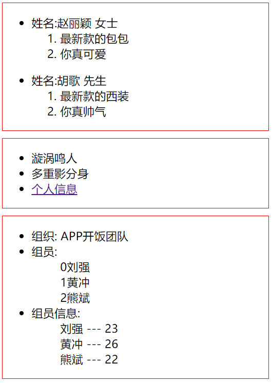

# template-web     

M：template-web是什么东西，有什么作用？

Z： 这是一个模板引擎，简单来说就是构建一个模板，让其生成html的js代码。如果不用该js，手动来操作，我们可能需要繁杂的拼接html标签，还要做for循环。

M：具体使用的方式是怎么样的呢？

Z：这里有个demo

```html
<!DOCTYPE html>
<html lang='en'>
<head>
<meta charset='UTF-8'>
<title>Title</title>
</head>
<body>
    <h3>模板引擎的使用</h3>
</body>
</html>

<!-- 模板 -->
<!-- 引入模板引擎js -->
<script src='template-web.js'></script>

<!-- 制作模板 -->
<script type="text/html" id="template">
    <ul>
        <li>姓名{{name}}</li>
        <li>年龄{{age}}</li>
        <li>电话{{phone}}</li>
    </ul>
</script>

<script>
    // 获取数据
    var data = {
        name:"Ray",
        age:"18",
        phone:"18233989613"
    };
    
    // 将数据放入模板中
    var res = template("template", data);
    console.log(res);

    // 将模板放入页面中
    document.body.innerHTML = res;

</script>
```

简要步骤就是：1.制作模板 2.将数据插入模板中 3.将模板插入html代码中   

#### if判断

M：但是呢，如果我们需要根据数据的不同，做出调整，要怎么使用不同的模板呢？

Z：可以在模板中进行判断，template-web提供的判断方法如下

```html
<!DOCTYPE html>
<html lang="en">
<head>
    <meta charset="UTF-8">
    <title>Title</title>

    <style type="text/css">

        div{
            border: red 1px solid;
            margin-top: 10px;
        }

    </style>
</head>
<body>

    <div id="ifBox"></div>

    <div id="norBox"></div>

    <div id="eachBox"></div>

<!--
     引入模板引擎:一般用于在网络请求之后，展示相同的多条数据
-->
<script type="text/javascript" src="template-web.js" ></script>

<!--
     1.逻辑语句---条件语句的使用
-->
<script type="text/html" id="ifPersonTemplate">
<ul>
    {{if sex=="女"}}
    <li>姓名:{{name}} 女士
       <ol>
           <li>最新款的包包</li>
           <li>你真{{skill}}</li>
       </ol>
    </li>
    {{else if sex=="男"}}
    <li>姓名:{{name}} 先生
        <ol>
            <li>最新款的西装</li>
            <li>你真{{skill}}</li>
        </ol>
    </li>
    {{/if}}
</ul>
</script>
<script type="text/javascript">

    //定义数据
    var person1 = {
        name:"赵丽颖",
        sex:"女",
        skill:"可爱"
    };

    var person2 = {
        name:"胡歌",
        sex:"男",
        skill:"帅气"
    };

    /**
     * 利用模板引擎 引用数据填充到模板中
     *
     * 参数一：模板id
     * 参数二：数据
     */
   var result =  template("ifPersonTemplate",person1);
    var result2 =  template("ifPersonTemplate",person2);

    //将返回的模板结果添加到界面中
    var ifBox = document.getElementById("ifBox");
    ifBox.innerHTML = result + result2;
</script>
```

#### html效果 

M：如果我想插入一段html标签，例如``<a>``标签，但是我直接插进去显示的是标签的内容，而并非效果，该怎么将html文本转化为html实现效果呢？

Z：在{{内容}}的内容前面添加@标志，如以下代码，即可将html文本转化为html实现效果

```html
<!--
     2.原文输出
-->
<script type="text/html" id="norTemplate">
     <ul>
         <li>{{name}}</li>
         <li>{{skill}}</li>
         <li>{{@info}}</li>
     </ul>
</script>
<script type="text/javascript">

    var data = {
       name:"漩涡鸣人",
       skill:"多重影分身",
       info:"<a href='https://baike.baidu.com/item/%E6%BC%A9%E6%B6%A1%E9%B8%A3%E4%BA%BA/322717?fr=aladdin'>个人信息</a>"
    };
    
    var result = template("norTemplate",data);
    var norBox = document.getElementById("norBox");
    norBox.innerHTML = result;
</script>
```

#### 循环   

M：现在有种需求就是，我得到返回数据的是一堆数组，我希望将数组循环输出模板，应该怎么实现？

Z：使用template-web.js自带的循环语句

```html
<!--
     3.循环语句
-->
<script type="text/html" id="eachTemplate">

     <ul>
         <li>组织: {{key}}}</li>
         <li>组员:
             {{each person}}
               <ol> {{$index}}{{$value}} </ol>
             {{/each}}
         </li>

         <li>组员信息:
             {{each info}}
             <ol>{{$value.name}} --- {{$value.age}} </ol>
             {{/each}}
         </li>
     </ul>
</script>
<script type="text/javascript">
      var family = {
          key:"APP开饭团队",
          person:[
              "刘强",
              "黄冲",
              "熊斌"
          ],
          info:[
              {name:"刘强",age:23},
              {name:"黄冲",age:26},
              {name:"熊斌",age:22}
          ]
      };

      var result = template("eachTemplate",family);

      var eachBox = document.getElementById("eachBox");
      eachBox.innerHTML = result;
</script>
```

D：以上三种效果分别对应以下三个红框（if判断，html效果，循环）

  

D：最后公布template-web.js的下载地址

```
链接：https://pan.baidu.com/s/1wBN9kZu0-Y1jKGJZHmmrvg 密码：i47d
```

_(本文例子来自[LQ-刘强](https://blog.csdn.net/qq_33429583))_  

